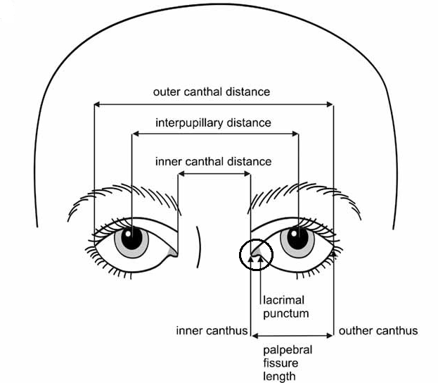

# baa-rnd-covideo-analytics
Fever Screening Application for COVID19 using thermal imaging. The idea is to use the 
thermal camera to get the temperature readings from the eye-canthus region (near tear duct). This region
is supposed to capture the core body temperature more accurately as compared to the other facial regions.
Below is the diagram showing the inner canthus region we want to capture. 
Fever Screening Application for COVID19 using thermal imaging

### Some Already available Dataset
* The dataset captures 112 participants and capture their IR and color images. 
The color images are captured using the Nikon D3100 DSLR camera while the IR images are 
captured using FLIR Vue Pro camera.
* Dataset Links
    * [IR images](https://www.kaggle.com/kpvisionlab/tufts-face-database-thermal-td-ir)
    * [Color Images](https://www.kaggle.com/kpvisionlab/tufts-face-database-computerized-sketches-td-cs)
 
 ### Some initial ideas 
 * Use color images to capture the faces and eye related features and map them to the 
 IR images to get the temperature readings for the eye canthus region.
    * Face recognition + face landmark detection using face_recognition
    * Aligning the IR image using the RGB image and use the facial feature imformation from optical image 
 * Try to detect the facial features from the IR image captured by the cameramd_resources